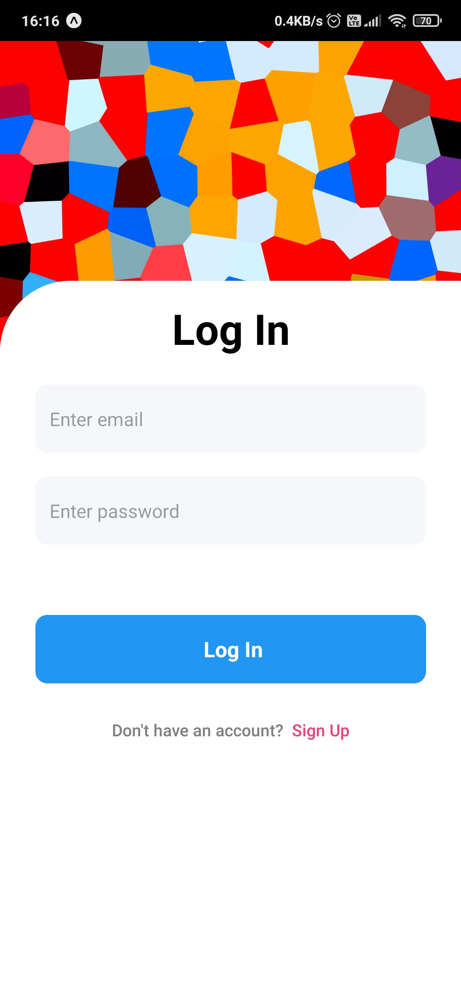

## ℹ️ Introduction

**React Native Chat App** is a real-time chat application built using [React Native](https://reactnative.dev/) powered by [Firebase](https://firebase.google.com/) for authentication and real-time messaging.


## ⚡ Features

| Feature             | Description                                                                                           |
| :------------------ | :---------------------------------------------------------------------------------------------------- |
| **Signup and Login**  | Firebase Email/Password sign-in method. Allow users to sign up using their email address and password |
| **Send Text Message** | Essential for casual messaging                                                                        |
| **Send Picture**      | You can send pictures without losing quality                                                          |
| **Group Chat**        | You can send your messages to multiple people at the same time                                        |
| **Delete Chat**       | Hold and select chats to delete them                                                                  |
| **Delete Account**    | Delete your account from settings                                                                     |
| **Real Time Chat**    | Chats update instantly with new messages                                                              |
| **Users List**        | Registered users sorted alphabetically                                                                |
| **Note to Self**      | Create personal notes by messaging yourself                                                           |

---

## 💾 Installation Guide

To clone and run this application, you'll need [Git](https://git-scm.com) and [Node.js](https://nodejs.org/en/download/) (with [npm](http://npmjs.com)).

```bash
# Clone this repository
git clone 
cd react-native-chat

# Install dependencies
npm install

---


> **Local Build:**
>
> ```bash
> # For android
> npm run android
>
> # For ios
> npm run ios
> ```

---

## 🪟 Screenshots

### **Login & Signup**
| Login | Signup |
| :---: | :----: |
|  |  |

### **Chats & Users**
| Chats | Users | Group Chat | Delete Chats |
| :---: | :---: | :--------: | :----------: |
|  |  |  |  |

### **Settings & More**
| Settings | Profile | Help | Account |
| :------: | :-----: | :--: | :-----: |
|  |  |  |  |

### **Chat Experience**
| Emoji Panel | Note to Self | Main Chat Screen | Chat Info |
| :---------: | :----------: | :--------------: | :-------: |
|  |  |  |  |

###  **Other**
| Message Indicator |
| :--------------: |
|  |

---


---

## 📈 Star History

<a href="https://app.repohistory.com/star-history?repo=Ctere1/react-native-chat">
  
</a>

---
